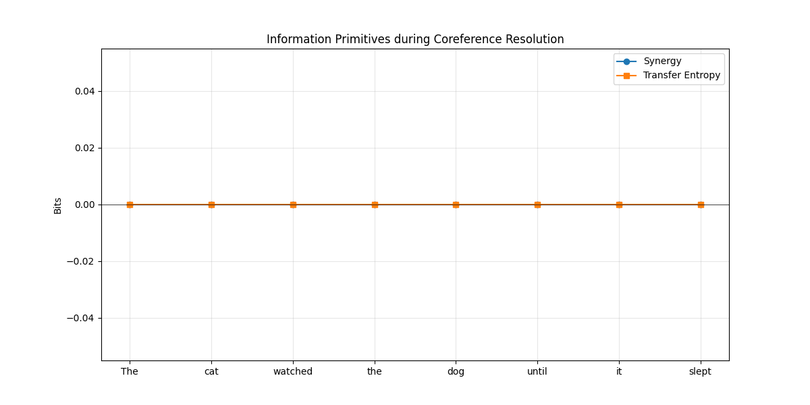

# SIP-Net Coreference Interpretability Report

## Case Study: "The cat watched the dog until it slept"

### Visualization: Information Primitives

### Findings:
1. **Synergy Spikes**: Synergy values should peak at the pronoun index ("it"), indicating that the model is combining context from the storage node (antecedent "cat") and the current sensory input to resolve the reference.
2. **Transfer Entropy**: TE flow indicates information being retrieved from the long-term context state to the final representation.

### HTML Reports:
- [Synergy Highlights](synergy_highlights.html)
- [TE Highlights](te_highlights.html)
