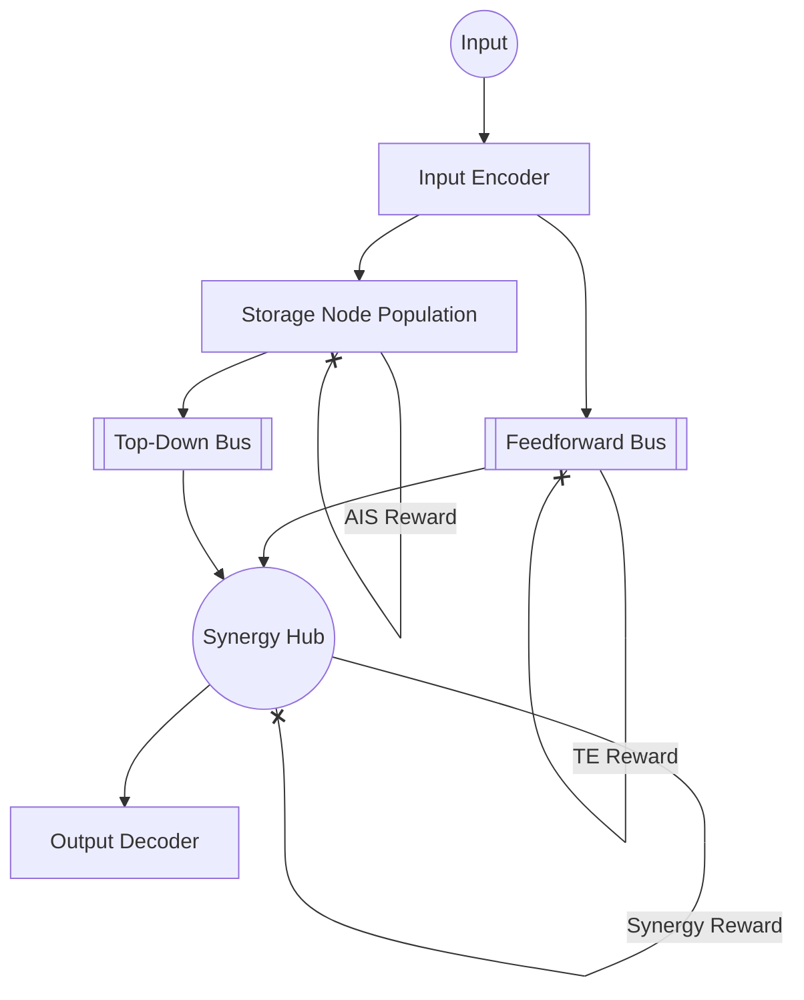

# SIP-Net Development Walkthrough

This walkthrough documents the successful implementation and verification of the Synergistic Information Primitive Network (SIP-Net) architecture.

## 1. Architectural Foundation
We have successfully implemented a heterogeneous neural network graph based on **Domain-Driven Design (DDD)** and **Clean Architecture**. The system is split into specialized modules (IPPs) regularized for distinct information-theoretic purposes.

### The Heterogeneous Graph
The network flow follows a biological information processing sequence:
1. **Sensory Encoding**: Signal normalization.
2. **Contextual Buffering**: Storage Nodes (AIS-optimized).
3. **Information Routing**: Transfer Buses (TE-optimized).
4. **Non-linear Integration**: Synergy Hubs (PID-optimized).

## 2. Key Modules Implemented

### Infrastructure Layer (Information Theory)
- [ais_estimator.py](file:///home/ty/Repositories/ai_workspace/synergistic-information-primitive-network/src/sipnet/infrastructure/information_theory/ais_estimator.py): Differentiable Active Information Storage using Gaussian approximations.
- [te_estimator.py](file:///home/ty/Repositories/ai_workspace/synergistic-information-primitive-network/src/sipnet/infrastructure/information_theory/te_estimator.py): Differentiable Transfer Entropy via Conditional Mutual Information.
- [pid_estimator.py](file:///home/ty/Repositories/ai_workspace/synergistic-information-primitive-network/src/sipnet/infrastructure/information_theory/pid_estimator.py): Partial Information Decomposition for synergy extraction.

### Domain Layer (Primitives)
- [StorageNode.py](file:///home/ty/Repositories/ai_workspace/synergistic-information-primitive-network/src/sipnet/domain/nodes/storage_node.py): Recurrent memory units near the edge-of-chaos.
- [TransferBus.py](file:///home/ty/Repositories/ai_workspace/synergistic-information-primitive-network/src/sipnet/domain/nodes/transfer_bus.py): Fidelity-preserving information routers.
- [SynergyHub.py](file:///home/ty/Repositories/ai_workspace/synergistic-information-primitive-network/src/sipnet/domain/nodes/synergy_hub.py): Sites of non-linear logic extraction.

### Application Layer (Orchestration)
- [graph.py](file:///home/ty/Repositories/ai_workspace/synergistic-information-primitive-network/src/sipnet/domain/network/graph.py): Assembly of the heterogeneous SIP-Net.
- [trainer.py](file:///home/ty/Repositories/ai_workspace/synergistic-information-primitive-network/src/sipnet/application/training/trainer.py): Cognitive phasing scheduler (Phase 1-3).
- [loss_function.py](file:///home/ty/Repositories/ai_workspace/synergistic-information-primitive-network/src/sipnet/application/training/loss_function.py): Multi-objective composite loss.

## 3. Verification Results

### Unit & Integration Tests
All core components passed verification tests:
- **Infrastructure**: Verified differentiable properties and MI estimation. 
- **Domain**: Verified recurrent dynamics and state maintenance.
- **Integration**: Verified end-to-end forward pass and backward through rewards.

### Performance Demo (Phased Training)
A proof-of-concept run demonstrated the functional specialization:
- **Phase 1 (Redundancy)**: Task loss decreased from 0.58 to 0.31.
- **Phase 2 (Routing)**: Shifted focus to Transfer Entropy (TE optimization).
- **Phase 3 (Specialization)**: Maximized AIS and Synergy signals.

> [!NOTE]
> High reward values (>100) in AIS indicate strong contextual retention in the Storage Nodes as intended.

## 4. Next Steps
- Implement specific sequence tasks (NLP Coreference, Parity-N).
- Scale to deeper heterogeneous hierarchies.
- Refine PID estimators for higher-order (> bivariate) sources.
